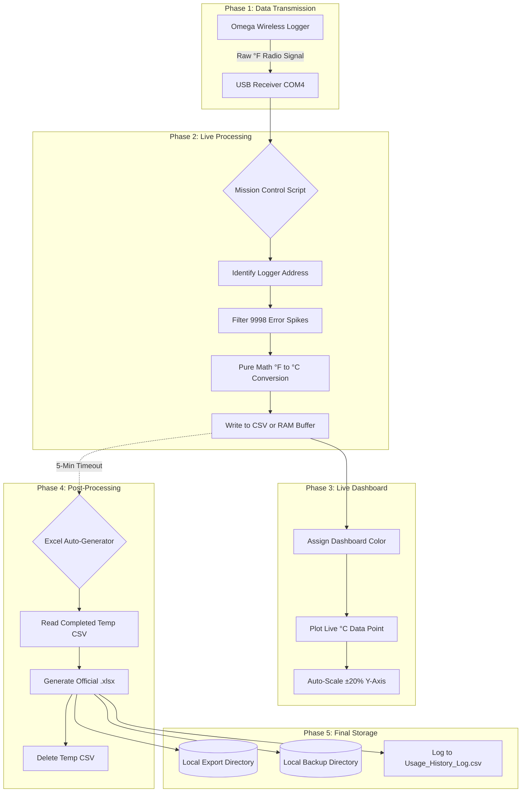

# Mission-Control-Logger
An automated Python dashboard for Omega wireless temperature probes. Features real-time live graphing and automated Excel export to eliminate manual data processing in high-volume environments.

## 📋 Overview
In fast-paced, high-volume laboratory and manufacturing environments, manual temperature logging and data post-processing create significant bottlenecks. **Mission Control** is a custom Python-based automation tool designed to eliminate these inefficiencies by interfacing directly with Omega UWTC wireless transmitters.

This system provides a live-view dashboard while silently exporting and graphing data directly into Excel, ensuring zero manual post-processing and protecting data integrity.

## ✨ Key Features
* **Automated Data Pipeline:** Eliminates manual data handling by automatically exporting and formatting logger data directly into Excel spreadsheets.
* **Live-View Visualization:** Real-time monitoring of multiple Omega temperature probes simultaneously on a unified dashboard.
* **"Stealth Mode" Operation:** Engineered to run in the background (utilizing a `.pyw` architecture) to prevent accidental system closure by non-technical staff in active environments.
* **Zero-Downtime Hot-Reloading:** Allows for the seamless integration of new hardware and configuration updates without needing to restart the primary logging system.
* **End-User Focused:** Deployed with comprehensive checklists and Standard Operating Procedures (SOPs) for smooth onboarding and operational consistency.

## 🛠️ Tech Stack & Hardware
* **Language:** Python
* **Hardware Integration:** Omega UWTC Wireless Temperature Transmitters & Receivers
* **Output:** Automated Excel integration

## 🚀 Deployment & Documentation
*(Note: Upload your SOP and checklist files to the repo, then link them here)*
* [Standard Operating Procedure (SOP) - User Guide](#)
* [System Deployment Checklist](#)

## 🚧 Current Roadmap
* Fine-tuning stealth mode file paths and automated shortcut deployments.
* Refining the hot-reload logic for even faster hardware pairing.
* Optimizing the deployment process for new user onboarding.
